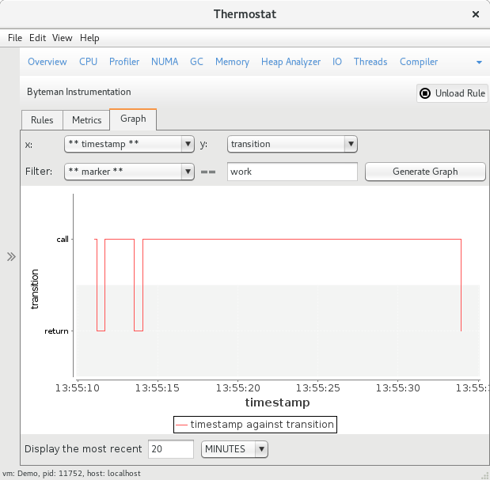
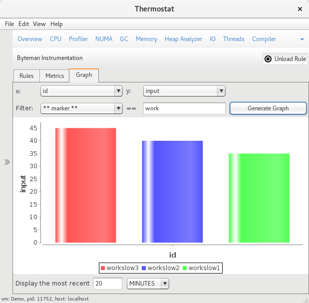
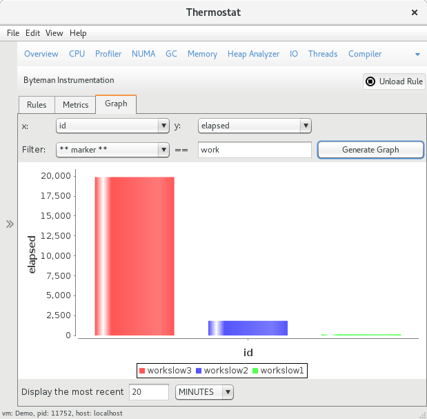

# Demo Application for Thermostat Byteman Plugin

## Build and Run the Application

In order to compile and run this demo application use:

    $ make
    $ make run

This will pop up a window where "slow and "fast" tasks
can be run.

*IMPORTANT*

Note that compiling class `Demo` with the `-g` switch is important for
certain instructions in the Byteman rules file to work.

You can clean up after a build with:

    $ make clean

## Using the Byteman Rules with Thermostat

### Build Thermostat

First, you'll need to clone and compile Thermostat from source.
This demo relies on bits currently only in HEAD. Please refer to
the [Thermostat getting started guide](http://icedtea.classpath.org/thermostat/getting-started/)
for details as to how to get the required dependencies and to
compile thermostat. Should you have all dependencies already,
something like this will work:

    $ hg clone http://icedtea.classpath.org/hg/thermostat
    $ cd thermostat
    $ mvn -Dmaven.test.skip=true clean package
    $ export PATH=$PATH:$(pwd)/distribution/target/image/bin

### Use the Provided Rules for Demo

First, start the `Demo` application (if not already done):

    $ make
    $ make run

Next, start Thermostat:

    $ thermostat local

Then, find the JVM corresponding to `Demo` and select it.

Next, switch to the Byteman tab shown for the `Demo` JVM.

Find the `Import Rule from File` button. Browse to the location
of this cloned repository and select the `rules.btm` file. This
will load the Byteman rules into the `Local Rule` widget.

Press the `>` icon in order to inject the rules into the `Demo`
JVM. Alternatively, press the `Inject Rule` button.

The `Demo` JVM should have the rules loaded and on the console
where you've started the `Demo` JVM you should see output similar to
this:

    Setting org.jboss.byteman.verbose=true
    Setting org.jboss.byteman.transform.all=true
    Setting org.jboss.byteman.thermostat.transport=localsocket
    Setting org.jboss.byteman.thermostat.socketName=f04d2a7e_a4ec_011752
    Setting org.jboss.byteman.thermostat.ipcConfig=/tmp/thermostat-ipc.properties.f04d2a7e-2d75-47da-b87f-c1ded182f66b
    Setting org.jboss.byteman.thermostat.agent.port=13300
    TransformListener() : accepting requests on localhost:13300
    TransformListener() : handling connection on port 13300
    TransformListener() : handling connection on port 13300
    TransformListener() : handling connection on port 13300
    retransforming Task
    org.jboss.byteman.agent.Transformer : possible trigger for rule iowait started in class Task
    RuleTriggerMethodAdapter.injectTriggerPoint : inserting trigger into Task.ioWait() void for rule iowait started
    org.jboss.byteman.agent.Transformer : inserted trigger for iowait started in class Task
    org.jboss.byteman.agent.Transformer : possible trigger for rule work started in class Task
    RuleTriggerMethodAdapter.injectTriggerPoint : inserting trigger into Task.doWork(int) void for rule work started
    org.jboss.byteman.agent.Transformer : inserted trigger for work started in class Task
    org.jboss.byteman.agent.Transformer : possible trigger for rule create timer and counter in class Task
    RuleTriggerMethodAdapter.injectTriggerPoint : inserting trigger into Task.<init>(java.lang.String) void for rule create timer and counter
    org.jboss.byteman.agent.Transformer : inserted trigger for create timer and counter in class Task
    org.jboss.byteman.agent.Transformer : possible trigger for rule work ended in class Task
    RuleTriggerMethodAdapter.injectTriggerPoint : inserting trigger into Task.doWork(int) void for rule work ended
    org.jboss.byteman.agent.Transformer : inserted trigger for work ended in class Task
    org.jboss.byteman.agent.Transformer : possible trigger for rule iowait ended in class Task
    RuleTriggerMethodAdapter.injectTriggerPoint : inserting trigger into Task.ioWait() void for rule iowait ended
    org.jboss.byteman.agent.Transformer : inserted trigger for iowait ended in class Task

Finally, run slow and/or fast tasks in the Demo application. Observe the
collected metrics showing up in Thermostat in the `Metrics` tab of the
Thermostat Byteman Plugin.

### Visualize Metrics

A state transition graph can be drawn from retrieved metrics by the following setting:

x-axis|y-axis|Filter-field|Filter-value
------|------|------------|------------
timestamp|transition|marker|work

Click `Generate Graph`. One will see the `call` and `return` transitions where the
`wait` durations stay approximately constant while the `work` sections show some
non-linearity.

A bar chart on the collected inputs of invocations of `doWork()` can be drawn by:

x-axis|y-axis|Filter-field|Filter-value
------|------|------------|------------
id|input|marker|work

Click `Generate Graph`. Shows a linear graph of the inputs. For both slow and fast
tasks.

A bar chart of the elapsed time each call of `doWork()` took can be drawn by:

x-axis|y-axis|Filter-field|Filter-value
------|------|------------|------------
id|elapsed|marker|work

Click `Generate Graph`. This clearly shows an exponential curve for the slow
task.

A bar chart of the elapsed time each call of `ioWait()` took can be drawn by:

x-axis|y-axis|Filter-field|Filter-value
------|------|------------|------------
id|elapsed|marker|wait

Click `Generate Graph`. This shows that each call to `ioWait()` took
a constant amount of time. About 500 miliseconds.

